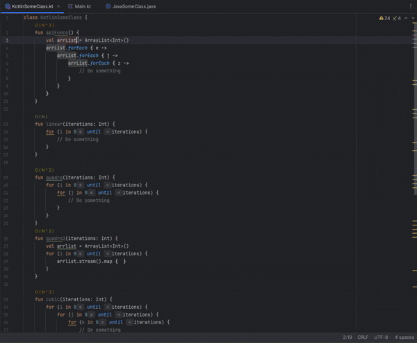
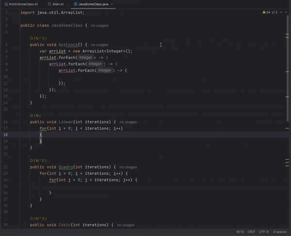
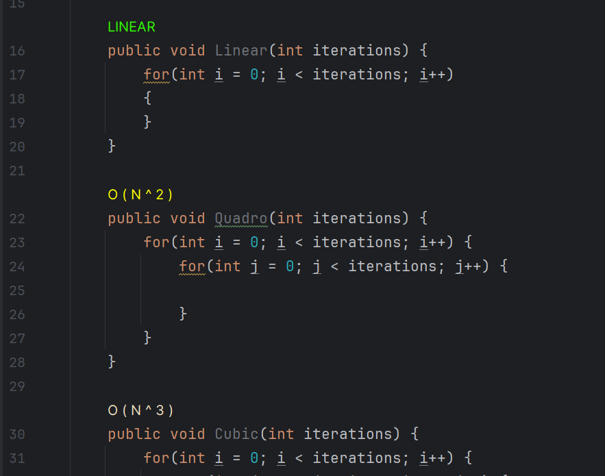
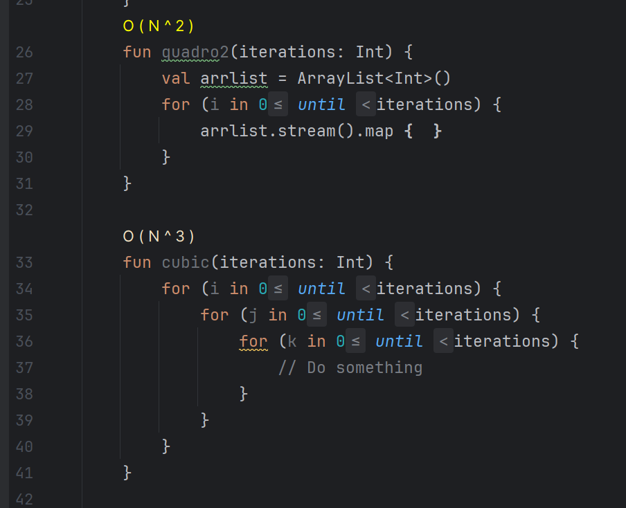

# CodeComplex by IFB ![Logo][logo]

_A lightweight plugin for JetBrains IDEs that reveals the runtime complexity of your methods with intuitive Big-O annotations._

---

## 🔍 What is CodeComplex?

**CodeComplex** analyzes your Java and Kotlin code and displays Big-O notation (`O(1)`, `O(n)`, `O(n²)`, etc.) above each method in real time — directly inside the editor.

This helps you:
- Instantly understand the runtime complexity of your code.
- Refactor complex logic early.
- Teach and learn algorithmic thinking visually.

---

## 🛠️ Features

- 📊 Detects `for`, `*.forEach`, and other linear functions from JAVA API.
- 🎯 Highlights methods with their estimated Big-O complexity.
- ⚡ Supports Java and Kotlin.
- 🧠 Powered by structural code analysis — no external tools required.

## 🖥️ Supported Platforms

- ✅ Windows 64-bit
- ✅ macOS (Apple Silicon, arm64)

---

### 💎 Upgrade to PRO

Want colored complexity indicators and enhanced analysis?

](https://www.digiseller.market/asp2/pay_wm.asp?id_d=5205974&lang=ru-RU)

Get the full power of **CodeComplex PRO by IFB** for Java and Kotlin in IntelliJ IDEA.

---

## 📸 Screenshots

 

---

## 🚀 Requirements

- JetBrains IntelliJ IDEA `2024.1` or newer.
- Java and/or Kotlin codebase.

---

## 📦 Installation

Find **CodeComplex by IFB** on the JetBrains Marketplace, or install manually:

1. Go to **Settings > Plugins > Marketplace**. Or directly by [Marketplace Link](https://plugins.jetbrains.com/plugin/27551-codecomplex-by-ifb-free-)
2. Search for `CodeComplex`.
3. Click **Install** and restart the IDE.

---

## 🧑‍💻 Author

Crafted with ❤️ by **IFB** - intfloatbool - Vladimir Khanyakin.  
Follow me for more tools and plugins.

---

## License

MIT License

---

[logo]: ./public_data/pluginIcon.png "Plugin Logo"
[screenshot1]: ./screenshot1.png "Example 1"
[screenshot2]: ./screenshot2.png "Example 2"
